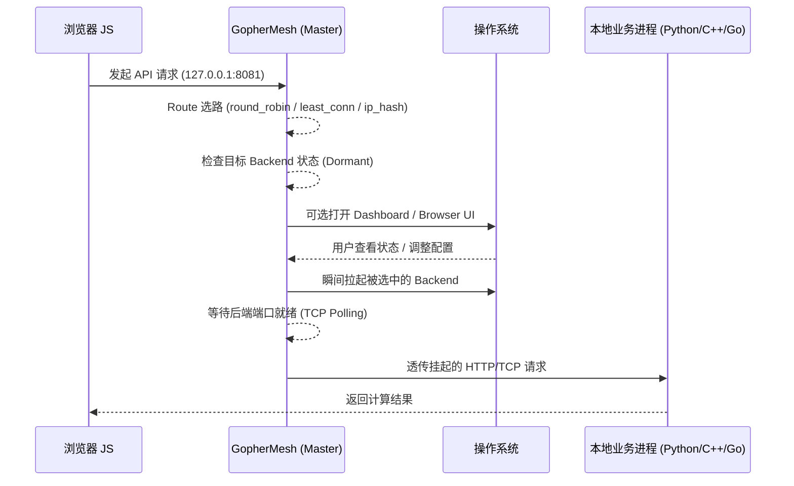

# GopherMesh 🐹

> **Burrowing through the Sandbox: A Lightweight Local/Edge Mesh Gateway and Process Orchestrator for HTTP/TCP Services.**

[](https://goreportcard.com/report/github.com/SUTFutureCoder/gophermesh)
[](https://opensource.org/licenses/MIT)

**GopherMesh** 是一套轻量、跨平台的本地/边缘/服务器侧 Mesh 接入与进程编排框架。它旨在打通浏览器、桌面前端、上层业务系统与本机/近端服务之间的调用链，为现代应用提供稳定的本地入口、自动化进程拉起与统一路由能力。

与其说它是一个工具，不如说它是一个 **“白嫖用户算力的善意特洛伊木马”** ：它静默驻留在底层，仅在网页、桌面端或上层业务需要调用本地/近端能力时，才按需唤醒并透明转发流量，例如 Go/Python/C++ 服务、本地 AI 推理、数据处理、硬件通信、自动化脚本或内部 TCP 服务。

相较于传统只负责反向代理的组件，**GopherMesh** 更强调“预置配置即开箱可用”“按请求冷启动本地进程”“HTTP/TCP 接入 + STDIO 请求驱动桥接”“可视化热重载管理”。因此它不仅适合桌面环境，也适合单机部署、边缘节点、轻量服务器以及更接近 Serverless / FaaS 的沙箱场景。它的定位不是单纯的 proxy，而是一个轻量级的 `mesh gateway + process orchestrator`。


## 适用场景 (Use Cases)

- 浏览器前端或桌面前端需要调用本地高性能服务
- AI Agent / Copilot / Web UI 需要稳定访问本机 CLI、模型服务或算法服务
- 将独立的 Go / Python / C++ 进程统一暴露为固定 HTTP/TCP 入口，或桥接为无内部监听端口的 STDIO Worker
- 本地工具、科研计算、数据处理、图像音频处理等任务需要按需拉起
- 硬件串口、局域网设备、本地守护进程或内网服务需要被统一编排与转发
- 轻量级沙箱、CLI Worker、单次任务型程序需要按连接 / 按请求拉起并在结束后自动回收

---

## 桌面自举模式 (Desktop Bootstrap Pattern)

对于桌面前端，推荐采用两段式接入：

1. 先探测本地 `HTTP/TCP` 端口是否已就绪。
2. 若本地服务不存在，再通过自定义协议拉起本地 launcher，例如 `gophermesh://launch`。
3. 进程拉起后，正式业务数据仍然走本地 `HTTP/TCP`，不要走自定义协议。

`port` 和 `conf` 都是可选参数：

- 不传 `port`：只负责确保 launcher / mesh 主进程已启动
- 传 `port`：额外校验该公网关路由是否存在，并在已就绪时直接忽略重复拉起
- 不传 `conf`：默认使用启动后的 `config.json`，若不存在则按默认逻辑自动生成
- 传 `conf`：显式指定启动时使用的配置文件

`GopherMesh` CLI 现已内置这套协议能力：

- 正常启动时会 best-effort 注册 `gophermesh://`
- 可通过 `-protocol-url "gophermesh://launch"` 处理外部协议拉起
- 可通过 `gophermesh://launch?port=18081` 指定目标公网关路由
- 可通过 `gophermesh://launch?port=18081&conf=sample/sample_config.json` 指定启动时使用的配置文件
- 可通过 `-noprotocol` 禁用协议注册与处理

注意：

- 若通过 `go run .` 启动，Go 会生成临时可执行文件；这类临时路径不会被注册为长期协议入口。
- 要让 `gophermesh://` 在进程退出后仍可重新拉起，请先构建正式二进制并运行一次。

---

## 安装与包结构 (Install & Packages)

CLI 安装：

```bash
go install github.com/SUTFutureCoder/gophermesh@latest
```

SDK 导入：

```bash
go get github.com/SUTFutureCoder/gophermesh/sdk
```

```go
import mesh "github.com/SUTFutureCoder/gophermesh/sdk"
```

常用入口：

- `github.com/SUTFutureCoder/gophermesh`：命令行程序，默认读取 `config.json`
- `github.com/SUTFutureCoder/gophermesh/sdk`：可嵌入的 Go SDK
- `github.com/SUTFutureCoder/gophermesh/sample/...`：HTTP/TCP 样例服务

如果你只是要接入本地服务，优先使用 CLI + `config.json`。
如果你要在自己的 Go 程序里自定义启动流程，再使用 `sdk`。

---

## 核心特性 (Key Features)

* **⚡ 缩容至零 (Scale-to-Zero):** 采用按请求/连接触发的冷启动（Cold Start）逻辑。后台业务进程在无流量时不占任何内存，只有被选中的后端才会在请求真正到达时被拉起。
* **🔀 路由级负载均衡 (Route + []Backend):** 一个对外端口可挂载多个后端实例，当前内置 `round_robin`、`least_conn`、`ip_hash` 三种策略，对齐 Nginx 常见 upstream 选路方式。
* **🌐 L7 HTTP / L4 TCP / Request-Driven STDIO:** 默认提供 L7 HTTP 透明反向代理，也支持通过 `protocol: "tcp"` 开启 L4 TCP 字节流透传，或通过 `protocol: "stdio"` 将单次请求/连接桥接到子进程 `stdin/stdout`。
* **🪶 面向轻量沙箱的无端口模式:** `stdio` 路由不要求 `internal_host` / `internal_port`；其中 `stdio_mode: "stream"` 保留原始字节流桥接，`stdio_mode: "http"` 则提供浏览器友好的 HTTP-over-STDIO 适配。两者都会在流量结束后自动 `Wait()` 回收，适合 FaaS、CLI Worker 与受限沙箱。
* **🖥️ Dashboard 可视化热重载:** 内置 Web Dashboard，可直接查看状态、日志、编辑 JSON、通过下拉框切换 `load_balance`、修改/删除子节点，并在更新成功后自动重新拉取最新配置；`stdio` 后端会以 `Request-Driven` 状态展示，不暴露常驻 PID / Kill 按钮。
* **🛡️ 浏览器原生界面 / 无头兼容:** 摒弃臃肿的 CGO 或 GUI 库。在桌面环境可自动尝试唤起系统默认浏览器；在无头服务器环境下即使无法弹出浏览器也不会影响主流程运行。
* **🔌 依赖倒置架构 (Dependency Inversion):** 既可以作为独立守护进程运行，也可以作为 `Go SDK` 被反向编译进业务代码中。
* **📦 零依赖分发 (Zero-CGO & Static):** 纯 Go 实现，无 CGO 依赖，支持 Windows/macOS/Linux 一键跨平台静态编译，单个二进制文件分发。
* **🌀 环路保护 (Loop Prevention):** 内置健康检查重定向逻辑，彻底杜绝代理配置导致的无限消息循环风暴。
* **🔒 透明 CORS 注入:** 默认支持 `trusted_origins` 白名单，允许按需放开或收敛跨域来源。

---

## 架构原理 (Architecture)



对于 `protocol: "stdio"` 的路由，数据面略有不同：GopherMesh 不再等待内部监听端口，而是为每条连接/请求动态拉起一个子进程，直接把入口流量桥接到子进程的 `stdin/stdout`，在流量结束后自动退出并回收。推荐显式声明 `stdio_mode`：

- `stream`：保留原始 L4 字节流语义，适合 TCP/CLI Worker。
- `http`：将入站请求按 HTTP 解析，把请求报文写入子进程 `stdin`，并把 `stdout` 以 chunked HTTP 持续回写给浏览器或 `curl -N`。
- `auto`：保留首包启发式兼容模式，但可能误判或破坏 server-speaks-first 协议，不推荐作为默认配置。

---

## 快速开始 (Quick Start)

### 1. 配置 `config.json`

在程序根目录下创建配置文件：

```json
{
  "dashboard_port": "9999",
  "routes": {
    "8081": {
      "name": "Local-Service",
      "load_balance": "round_robin",
      "backends": [
        {
          "name": "service-a",
          "cmd": "python",
          "args": ["app.py", "--port", "9081"],
          "internal_port": "9081"
        },
        {
          "name": "service-b",
          "cmd": "python",
          "args": ["app.py", "--port", "9082"],
          "internal_port": "9082"
        }
      ]
    },
    "8082": {
      "name": "Internal-Healthcheck",
      "backends": [
        {
          "name": "dashboard",
          "cmd": "internal",
          "internal_port": "9999"
        }
      ]
    }
  }
}
```

说明：

- `routes` 的 key 是对外暴露端口。
- 每个 `route` 可以挂多个 `backends`，默认使用 `round_robin`。
- `load_balance` 当前支持 `round_robin`、`least_conn`、`ip_hash`。
- 默认协议为 HTTP；若要启用 L4 透传，可设置 `protocol: "tcp"`；若要启用按请求 `stdin/stdout` 桥接，可设置 `protocol: "stdio"`。
- 当 `protocol: "stdio"` 时，backend 不需要 `internal_host` 和 `internal_port`；此时子进程会在每次请求/连接到达时拉起，并在处理结束后自动销毁。
- `stdio_mode` 仅对 `protocol: "stdio"` 生效，支持 `stream`、`http`、`auto`；默认值为 `stream`。
- 冷启动仍然是 serverless 风格，但粒度已经下沉到“本次请求选中的 backend”。

例如，一个最小的 `stdio` route 可以写成：

```json
{
  "routes": {
    "17083": {
      "name": "Sample-L4-STDIO-Echo",
      "protocol": "stdio",
      "stdio_mode": "stream",
      "backends": [
        {
          "name": "stdio-echo-a",
          "cmd": "go",
          "args": ["run", "./sample/stdio/echo", "-name", "stdio-echo-a"]
        }
      ]
    }
  }
}
```

### 2. 启动主进程

```bash
go run . -config config.json
```

或者直接安装后运行：

```bash
gophermesh -config config.json
```

开箱即用逻辑：

- 默认启动参数就是 `-config config.json`，因此你可以直接随发布包预置一份 `config.json`
- 用户只需要启动 `GopherMesh`，主进程就会自动读取这份配置并加载对应的 route/backend
- 如果当前目录下还没有 `config.json`，程序会自动生成一份默认配置并落盘，便于首次启动和后续修改

可选参数：

- `-dashboard-host`：覆盖 Dashboard 监听地址，例如 `0.0.0.0`
- `-dashboard-port`：覆盖 Dashboard 监听端口
- `-no-dashboard`：静默运行，不自动打开浏览器中的 Dashboard 页面
- `-noprotocol`：禁用 `gophermesh://` 协议注册与处理

也可以直接运行样例配置：

```bash
go run . -config sample/sample_config.json
```

如果已通过 `go install` 安装：

```bash
gophermesh -config sample/sample_config.json
```

启动后可打开 Dashboard：

- 默认配置：`http://127.0.0.1:9999`
- 样例配置：`http://127.0.0.1:19999`

### 3. Dashboard 能做什么

- 查看每个 route/backend 的运行状态、PID、Uptime 与最近日志
- 对托管的本地进程执行 `杀死 (Kill)`；远程纯代理 backend 与 `stdio` request-driven backend 不提供此按钮
- 在表单里新增/编辑子节点，并同步修改父级 route 的 `protocol` / `load_balance` / `stdio_mode`
- 在表单中切换到 `protocol: "stdio"` 时，自动隐藏 `Target Host / Port` 字段，并按 `stream` / `http` / `auto` 写入请求驱动配置
- 直接删除子节点；如果某个 route 的子节点删空，则自动清理该 route 对象
- 通过 JSON 面板整体热重载；成功后界面会自动重新拉取最新配置
- 对 `stdio` backend 使用稳定的 backend ref 读取日志，因此即使它没有 `internal_port` 也能在 Dashboard 中查看最近输出

### 4. 运行命令与样例

先直接运行官方样例：

```bash
go run . -config sample/sample_config.json
```

或者先编译再运行：

```bash
go build -o gophermesh .
./gophermesh -config sample/sample_config.json
```

Windows PowerShell：

```powershell
go build -o gophermesh.exe .
.\gophermesh.exe -config sample/sample_config.json -no-dashboard
```

或者安装后直接运行：

```powershell
gophermesh -config sample/sample_config.json
```

如果要让局域网设备访问 Dashboard：

```bash
go run . -config sample/sample_config.json -dashboard-host 0.0.0.0 -dashboard-port 29999
```

HTTP 样例：

```bash
curl "http://127.0.0.1:18081/healthz"
curl "http://127.0.0.1:18082/sum?a=3&b=4"
curl -H "Origin: https://example.com" "http://127.0.0.1:18082/headers"
curl -N "http://127.0.0.1:17084/"
```

`/healthz` 约定：

- 内部健康路由统一返回 JSON 探活结果，默认字段包括 `ok`、`status`、`mesh`、`version`
- 默认版本号为 `0.0.1`
- 若通过 SDK 嵌入，可附加自定义字段，但保留字段仍由 SDK 控制

SDK 自定义 `healthz` 样例：

```go
engine, err := mesh.NewEngineWithOptions(cfg, mesh.EngineOptions{
  Healthz: mesh.HealthzOptions{
    Version: "0.4.0",
    Fields: map[string]any{
      "name": "etaiIotPlugin",
      "time": time.Now().Unix(),
    },
  },
})
```

对应探活响应示例：

```json
{
  "ok": true,
  "status": "ok",
  "mesh": "running",
  "version": "0.4.0",
  "name": "etaiIotPlugin",
  "time": 1770000000
}
```

TCP 样例：

```bash
echo hello | nc 127.0.0.1 17081
printf "hello\nworld\n" | nc 127.0.0.1 17082
echo hello-stdio | nc 127.0.0.1 17083
```

Windows PowerShell TCP 样例：

```powershell
$tcp = [System.Net.Sockets.TcpClient]::new("127.0.0.1", 17081)
$stream = $tcp.GetStream()
$data = [System.Text.Encoding]::UTF8.GetBytes("hello")
$stream.Write($data, 0, $data.Length)
$tcp.Client.Shutdown([System.Net.Sockets.SocketShutdown]::Send)
$reader = New-Object System.IO.StreamReader($stream)
$reader.ReadToEnd()
$tcp.Close()

$tcp = [System.Net.Sockets.TcpClient]::new("127.0.0.1", 17083)
$stream = $tcp.GetStream()
$data = [System.Text.Encoding]::UTF8.GetBytes("hello-stdio")
$stream.Write($data, 0, $data.Length)
$tcp.Client.Shutdown([System.Net.Sockets.SocketShutdown]::Send)
$reader = New-Object System.IO.StreamReader($stream)
$reader.ReadToEnd()
$tcp.Close()
```

Windows PowerShell / CMD 下测试浏览器兼容的 HTTP -> STDIO 持续回写：

```powershell
curl.exe -N http://127.0.0.1:17084/
curl.exe -N -X POST http://127.0.0.1:17084/ -H "Content-Type: text/plain" --data-binary "hello from windows"
```

说明：

- `17083` 现在是显式 `stdio_mode: "stream"`，用于验证原始 TCP -> STDIO 路径；像 `io.ReadAll(os.Stdin)` 这类 Worker 需要客户端在写入后调用 `Shutdown(Send)` 主动发送 EOF。
- `17084` 是显式 `stdio_mode: "http"`，GopherMesh 会把完整 HTTP 请求写入子进程 `stdin`，并把子进程 `stdout` 以 chunked 方式持续回写给浏览器或 `curl.exe -N`。

以上命令分别对应：

- `18081`：L7 HTTP `least_conn`
- `18082`：L7 HTTP `ip_hash`
- `17081`：L4 TCP Echo
- `17082`：L4 TCP Uppercase
- `17083`：STDIO Echo，显式 `stream` 模式
- `17084`：STDIO Echo，显式 `http` 模式，可直接用浏览器 / `curl.exe -N` 验证 HTTP-over-STDIO 持续回写

### 5. Release 样例

本地生成跨平台发布包：

```powershell
powershell -ExecutionPolicy Bypass -File .\scripts\release.ps1 -Version v1.2.2
```

构建并自动发布到 GitHub Release：

```powershell
powershell -ExecutionPolicy Bypass -File .\scripts\release.ps1 -Version v1.2.2 -Publish
```

如果已经本地构建完成，也可以直接用 `gh` 手动创建 Release：

```powershell
gh release create v1.2.2 .\dist\v1.2.2\* --title "v1.2.2" --generate-notes
```

### 6. SDK 最小示例

如果你需要把 GopherMesh 引擎嵌入自己的 Go 程序，可以使用 `sdk`：

```go
package main

import (
  "context"
  "log"
  "os"
  "os/signal"
  "syscall"
  "time"

  mesh "github.com/SUTFutureCoder/gophermesh/sdk"
)

func main() {
  cfg, err := mesh.LoadConfig("config.json")
  if err != nil {
    log.Fatal(err)
  }
  cfg.ConfigPath = "config.json"

  engine, err := mesh.NewEngine(cfg)
  if err != nil {
    log.Fatal(err)
  }

  ctx, cancel := signal.NotifyContext(context.Background(), os.Interrupt, syscall.SIGTERM)
  defer cancel()

  if err := engine.Run(ctx); err != nil {
    log.Printf("engine stopped: %v", err)
  }

  shutdownCtx, shutdownCancel := context.WithTimeout(context.Background(), 5*time.Second)
  defer shutdownCancel()

  if err := engine.Shutdown(shutdownCtx); err != nil {
    log.Fatal(err)
  }
}
```

---

## 为什么 DIY 这个项目？

很多实际系统都会遇到同一个问题：前端需要一个稳定、简单、跨平台的本地入口，但真正的业务能力往往运行在另一个独立进程里。现有方案要么过于沉重（整套桌面壳），要么接入复杂（浏览器扩展、Native Messaging、自定义桥接层）。

**GopherMesh** 追求的是一种更通用的平衡：**底层足够硬核，表层足够轻盈，分发尽可能简单。** 你可以把它理解为一个专门面向“本地服务接入、进程编排、桌面自举、HTTP/TCP 统一入口”的通用基础框架。

---

## 样例截图

### 控制台


### 浏览器-本机高性能边缘计算


### 浏览器协议拉起


### 协议自动写入注册表


---

## 许可证 (License)

[MIT License](https://www.google.com/search?q=LICENSE)

---

© 2026 Starry Intelligence Technology Limited. Built with hard-coded passion.
