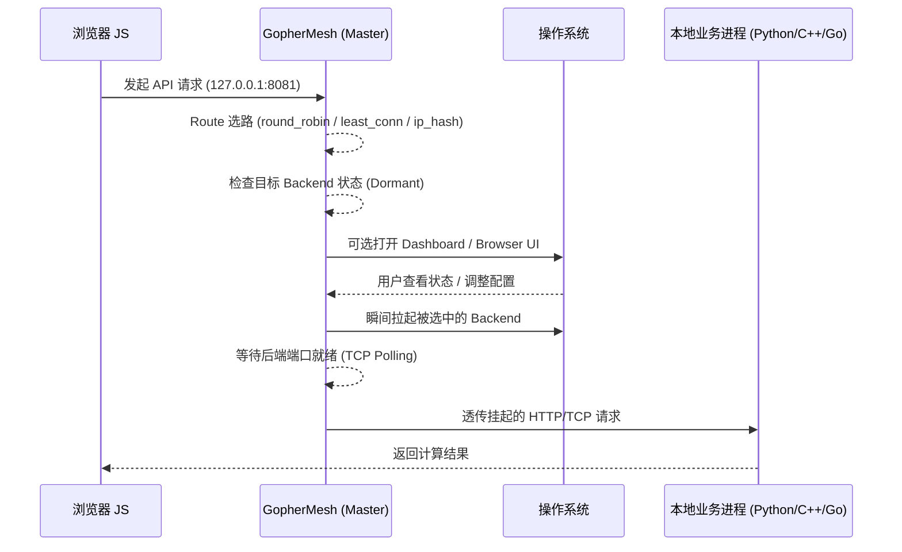

# GopherMesh 🐹

> **Burrowing through the Sandbox: A Lightweight Local/Edge Mesh Gateway and Process Orchestrator for HTTP/TCP Services.**

[](https://goreportcard.com/report/github.com/xingchen/gophermesh)
[](https://opensource.org/licenses/MIT)

**GopherMesh** 是一套极其轻量、跨平台的本地/边缘/服务器侧 Mesh 接入与进程编排框架。它旨在打破浏览器沙盒（Browser Sandbox）与操作系统原生算力（Native OS Capability）之间的物理隔阂，为现代 Web 应用提供“零延迟、高权限、自动化”的本机或近端算力调度能力。

与其说它是一个工具，不如说它是一个 **“善意的特洛伊木马”** ：它静默地驻留在底层，仅在网页、桌面端或上层业务需要调用高性能本地/近端服务（如 Python AI 推理、C++ 图像处理、硬件串口通信、Go 算法服务）时，才按需唤醒并透明转发流量。

相较于传统只负责反向代理的组件，**GopherMesh** 更强调“预置配置即开箱可用”“按请求冷启动本地进程”“HTTP/TCP 双协议接入”“可视化热重载管理”。因此它不仅适合桌面环境，也适合单机部署、边缘节点和轻量服务器场景。它的定位不是单纯的 proxy，而是一个轻量级的 `mesh gateway + process orchestrator`。

---

## 核心特性 (Key Features)

* **⚡ 缩容至零 (Scale-to-Zero):** 采用按请求/连接触发的冷启动（Cold Start）逻辑。后台业务进程在无流量时不占任何内存，只有被选中的后端才会在请求真正到达时被拉起。
* **🔀 路由级负载均衡 (Route + []Backend):** 一个对外端口可挂载多个后端实例，当前内置 `round_robin`、`least_conn`、`ip_hash` 三种策略，对齐 Nginx 常见 upstream 选路方式。
* **🌐 L7 HTTP / L4 TCP 双栈代理:** 默认提供 L7 HTTP 透明反向代理，也支持通过 `protocol: "tcp"` 开启 L4 TCP 字节流透传。
* **🖥️ Dashboard 可视化热重载:** 内置 Web Dashboard，可直接查看状态、日志、编辑 JSON、通过下拉框切换 `load_balance`、修改/删除子节点，并在更新成功后自动重新拉取最新配置。
* **🛡️ 浏览器原生界面 / 无头兼容:** 摒弃臃肿的 CGO 或 GUI 库。在桌面环境可自动尝试唤起系统默认浏览器；在无头服务器环境下即使无法弹出浏览器也不会影响主流程运行。
* **🔌 依赖倒置架构 (Dependency Inversion):** 既可以作为独立守护进程运行，也可以作为 `Go SDK` 被反向编译进业务代码中。
* **📦 零依赖分发 (Zero-CGO & Static):** 纯 Go 实现，无 CGO 依赖，支持 Windows/macOS/Linux 一键跨平台静态编译，单个二进制文件分发。
* **🌀 环路保护 (Loop Prevention):** 内置健康检查重定向逻辑，彻底杜绝代理配置导致的无限消息循环风暴。
* **🔒 透明 CORS 注入:** 默认支持 `trusted_origins` 白名单，允许按需放开或收敛跨域来源。

---

## 架构原理 (Architecture)



---

## 快速开始 (Quick Start)

### 1. 配置 `config.json`

在程序根目录下创建配置文件：

```json
{
  "dashboard_port": "9999",
  "routes": {
    "8081": {
      "name": "Bayesian-Optimizer",
      "load_balance": "round_robin",
      "backends": [
        {
          "name": "optimizer-a",
          "cmd": "python",
          "args": ["opt.py", "--port", "9081"],
          "internal_port": "9081"
        },
        {
          "name": "optimizer-b",
          "cmd": "python",
          "args": ["opt.py", "--port", "9082"],
          "internal_port": "9082"
        }
      ]
    },
    "8082": {
      "name": "Internal-Healthcheck",
      "backends": [
        {
          "name": "dashboard",
          "cmd": "internal",
          "internal_port": "9999"
        }
      ]
    }
  }
}

```

说明：

- `routes` 的 key 是对外暴露端口。
- 每个 `route` 可以挂多个 `backends`，默认使用 `round_robin`。
- `load_balance` 当前支持 `round_robin`、`least_conn`、`ip_hash`。
- 默认协议为 HTTP；若要启用 L4 透传，可设置 `protocol: "tcp"`。
- 冷启动仍然是 serverless 风格，但粒度已经下沉到“本次请求选中的 backend”。

### 2. 启动主进程

```bash
go run . -config config.json
```

开箱即用逻辑：

- 默认启动参数就是 `-config config.json`，因此你可以直接随发布包预置一份 `config.json`
- 用户只需要启动 `GopherMesh`，主进程就会自动读取这份配置并加载对应的 route/backend
- 如果当前目录下还没有 `config.json`，程序会自动生成一份默认配置并落盘，便于首次启动和后续修改

可选参数：

- `-dashboard-host`：覆盖 Dashboard 监听地址，例如 `0.0.0.0`
- `-dashboard-port`：覆盖 Dashboard 监听端口

也可以直接运行样例配置：

```bash
go run . -config sample/sample_config.json
```

启动后可打开 Dashboard：

- 默认配置：`http://127.0.0.1:9999`
- 样例配置：`http://127.0.0.1:19999`

### 3. Dashboard 能做什么

- 查看每个 route/backend 的运行状态、PID、Uptime 与最近日志
- 对托管的本地进程执行 `杀死 (Kill)`；远程纯代理 backend 不提供此按钮
- 在表单里新增/编辑子节点，并同步修改父级 route 的 `protocol` / `load_balance`
- 直接删除子节点；如果某个 route 的子节点删空，则自动清理该 route 对象
- 通过 JSON 面板整体热重载；成功后界面会自动重新拉取最新配置

### 4. 运行命令与样例

先直接运行官方样例：

```bash
go run . -config sample/sample_config.json
```

或者先编译再运行：

```bash
go build -o gophermesh .
./gophermesh -config sample/sample_config.json
```

Windows PowerShell：

```powershell
go build -o gophermesh.exe .
.\gophermesh.exe -config sample/sample_config.json
```

如果要让局域网设备访问 Dashboard：

```bash
go run . -config sample/sample_config.json -dashboard-host 0.0.0.0 -dashboard-port 29999
```

HTTP 样例：

```bash
curl "http://127.0.0.1:18081/healthz"
curl "http://127.0.0.1:18082/sum?a=3&b=4"
curl -H "Origin: https://example.com" "http://127.0.0.1:18082/headers"
```

TCP 样例：

```bash
echo hello | nc 127.0.0.1 17081
printf "hello\nworld\n" | nc 127.0.0.1 17082
```

Windows PowerShell TCP 样例：

```powershell
$tcp = [System.Net.Sockets.TcpClient]::new("127.0.0.1", 17081)
$stream = $tcp.GetStream()
$data = [System.Text.Encoding]::UTF8.GetBytes("hello")
$stream.Write($data, 0, $data.Length)
$tcp.Client.Shutdown([System.Net.Sockets.SocketShutdown]::Send)
$reader = New-Object System.IO.StreamReader($stream)
$reader.ReadToEnd()
$tcp.Close()
```

以上命令分别对应：

- `18081`：L7 HTTP `least_conn`
- `18082`：L7 HTTP `ip_hash`
- `17081`：L4 TCP Echo
- `17082`：L4 TCP Uppercase

---

## 为什么 DIY 这个项目？

在量化交易与工业物联网（IoT）领域，我们经常面临“Web 界面太弱、云端算力太贵/太远”的尴尬。现有的方案要么过于沉重（Electron），要么极其繁琐（Native Messaging）。

**GopherMesh** 追求的是一种极客式的平衡：**底层极度硬核（Go/Syscall），表层极度轻盈（HTML5），分发极度简单。** 它是为了那些在深夜里，依然追求极致系统掌控感的开发者而生的。


---

## 许可证 (License)

[MIT License](https://www.google.com/search?q=LICENSE)

---

© 2026 Starry Intelligence Technology Limited. Built with hard-coded passion.
